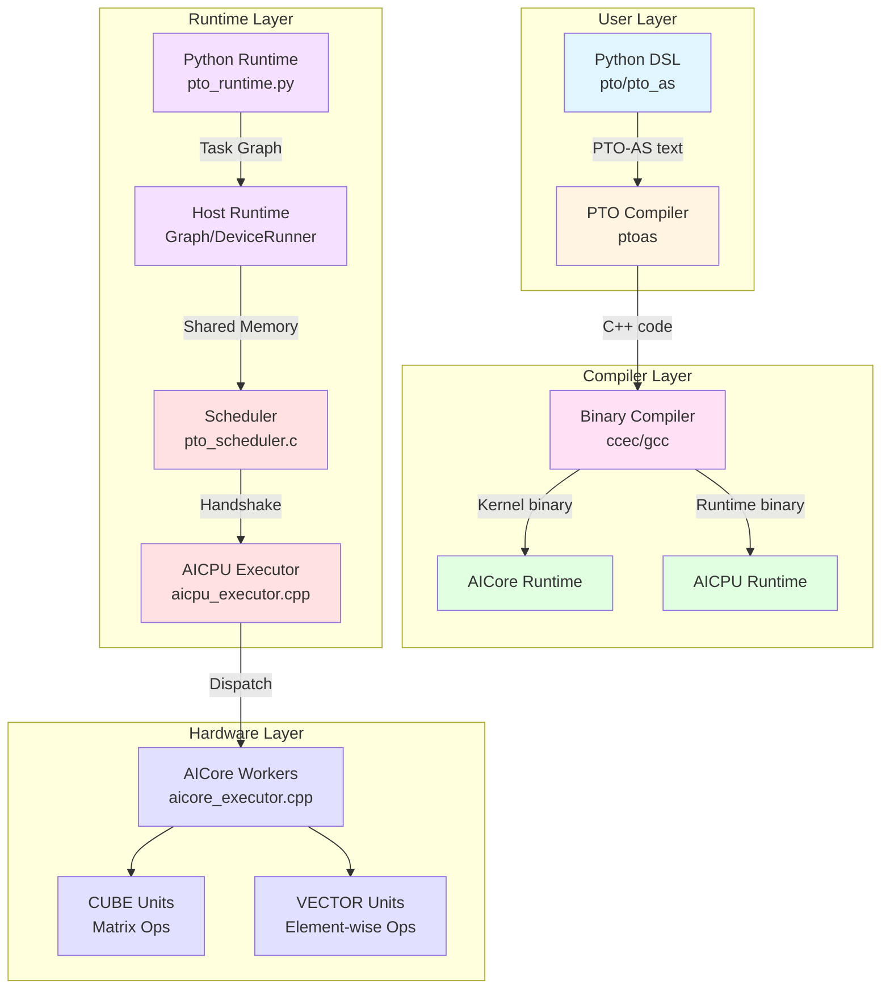
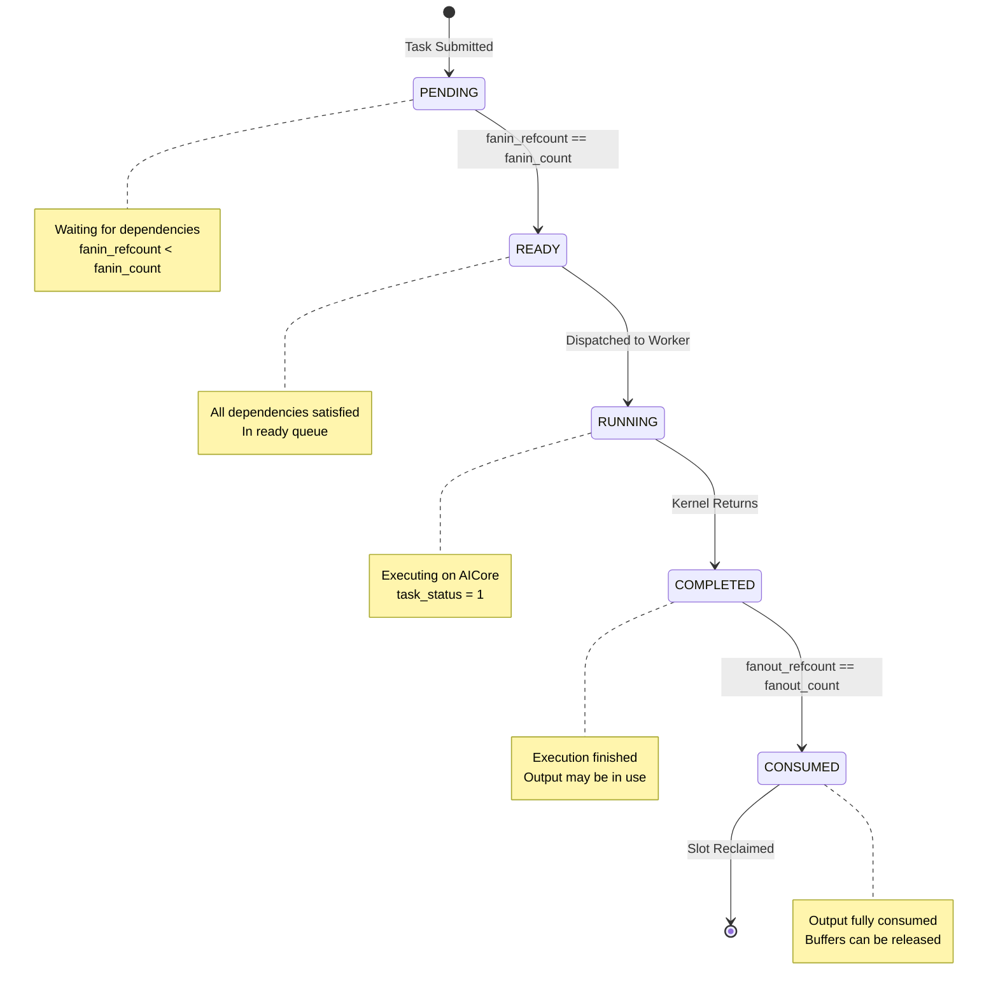
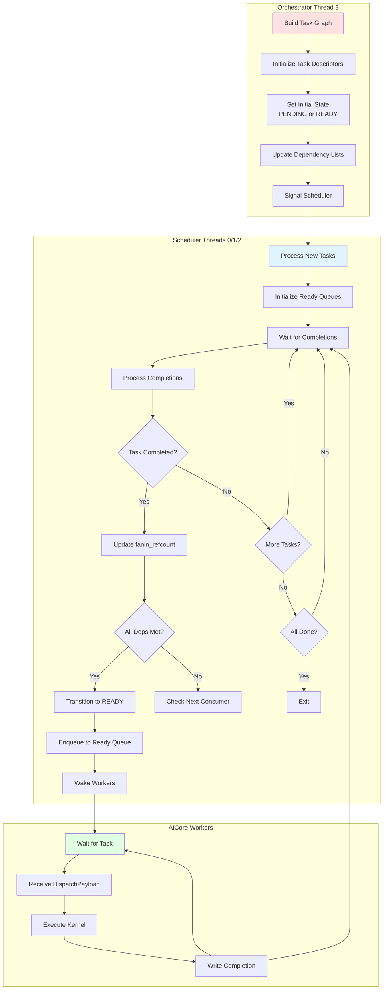
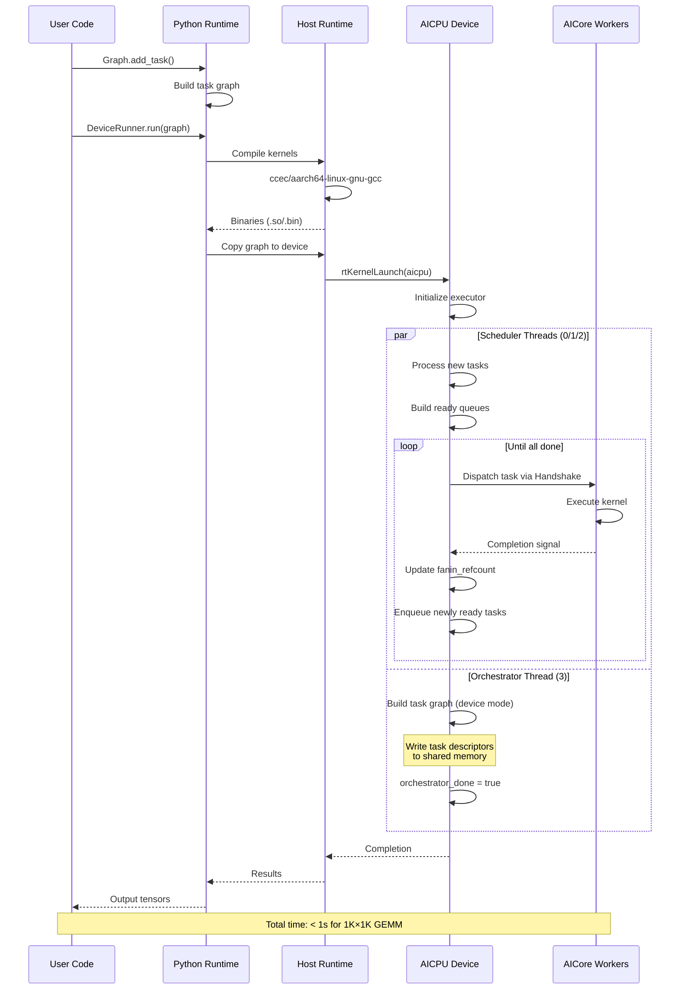
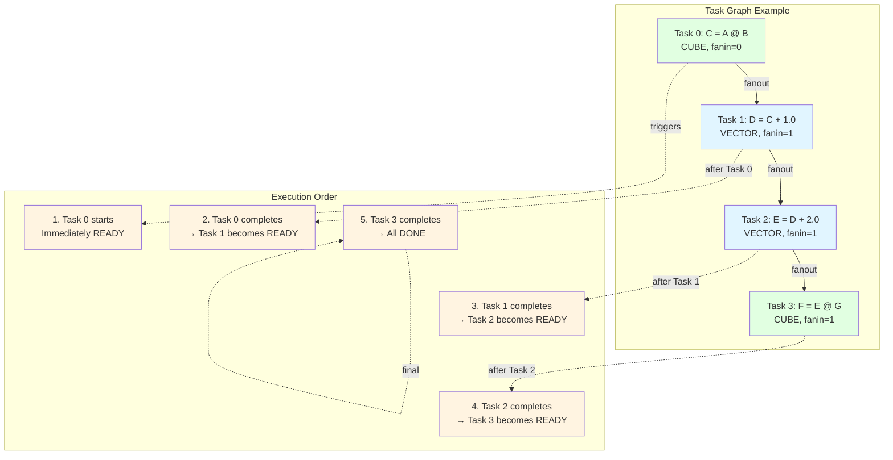
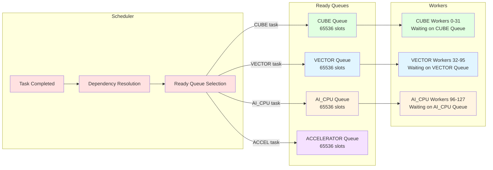
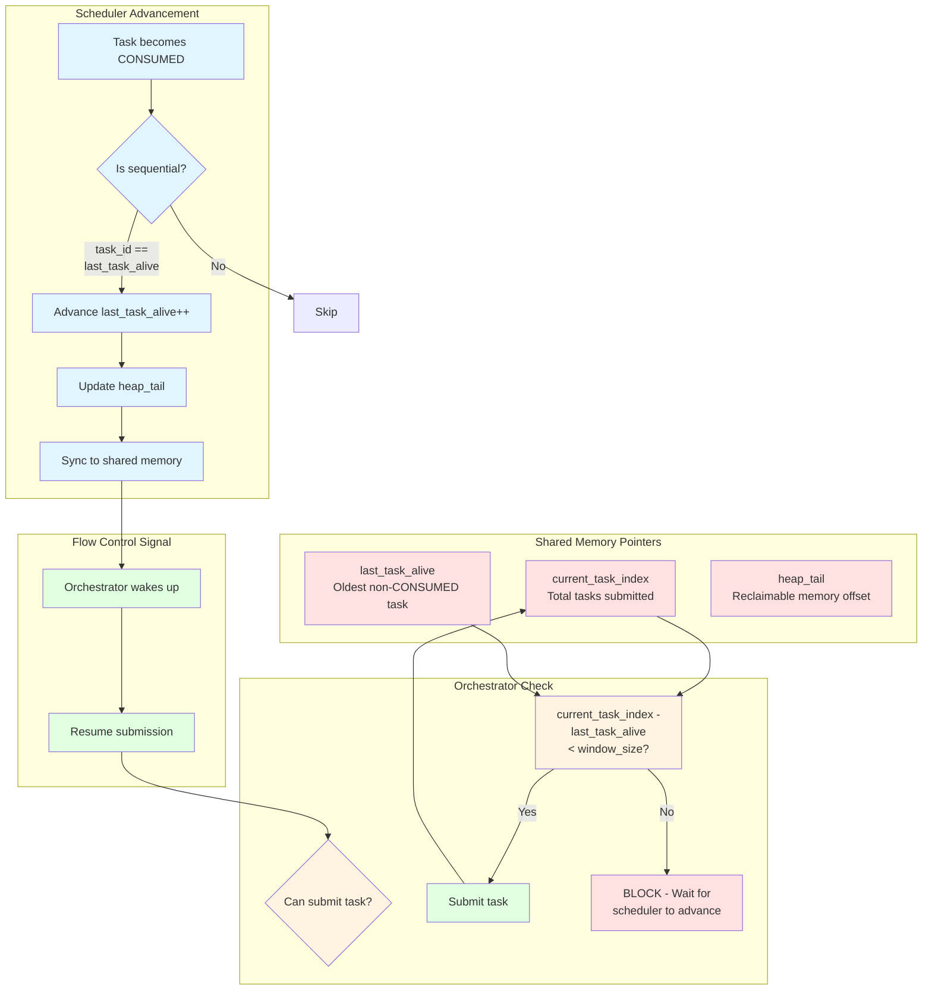

# PTO-ISA Architecture Diagrams

This document contains visual architecture diagrams for the PTO-ISA system.

## Table of Contents
1. [System Architecture](#1-system-architecture)
2. [Task State Machine](#2-task-state-machine)
3. [Scheduler Architecture](#3-scheduler-architecture)
4. [Memory Layout](#4-memory-layout)
5. [Execution Flow](#5-execution-flow)
6. [Dependency Graph](#6-dependency-graph)

---

## 1. System Architecture



---

## 2. Task State Machine



---

## 3. Scheduler Architecture



---

## 4. Memory Layout

```mermaid
graph TB
    subgraph "Shared Memory (GM)"
        A[Shared Memory Header]
        B[Task Descriptor Ring Buffer<br/>16,384 slots × 340 bytes]
        C[Dependency List Pool<br/>65,536 entries × 8 bytes]
        D[TensorMap<br/>Hash table for alias tracking]
        E[GM Heap<br/>Packed output buffers]
    end

    subgraph "Task Descriptor (340 bytes)"
        F[task_id: int32]
        G[kernel_id: int32]
        H[worker_type: int32]
        I[fanin_head: int32]
        J[fanin_count: int32]
        K[fanout_lock: volatile int32]
        L[fanout_head: volatile int32]
        M[fanout_count: volatile int32]
        N[packed_buffer_base: void*]
        O[packed_buffer_end: void*]
        P[output_offsets[16]: int32]
        Q[num_outputs: int32]
        R[func_ptr: void*]
        S[func_name: char*]
    end

    subgraph "GM Heap Layout"
        T[Task 0 Output<br/>offset 0-4096]
        U[Task 1 Output<br/>offset 4096-8192]
        V[Task 2 Output<br/>offset 8192-12288]
        W[Free Space<br/>offset 12288+]
    end

    A --> B
    A --> C
    A --> D
    A --> E

    B --> F
    E --> T

    style A fill:#ffe1e1
    style B fill:#e1f5ff
    style C fill:#fff4e1
    style D fill:#f5e1ff
    style E fill:#e1ffe1
```

---

## 5. Execution Flow



---

## 6. Dependency Graph Example



---

## 7. Ready Queue Distribution



---

## 8. Flow Control Mechanism



---

## Diagram Usage

These diagrams can be viewed in any Mermaid-compatible viewer:
- **GitHub**: Automatically renders in markdown files
- **VS Code**: Install "Markdown Preview Mermaid Support" extension
- **Online**: Use [Mermaid Live Editor](https://mermaid.live)
- **Documentation**: Export to PNG/SVG for presentations

---

**Last Updated**: 2025-02-09
**Total Diagrams**: 8
**Formats**: Mermaid (text-based, version control friendly)
